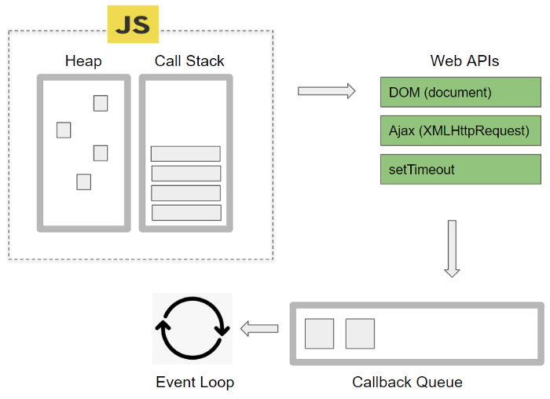
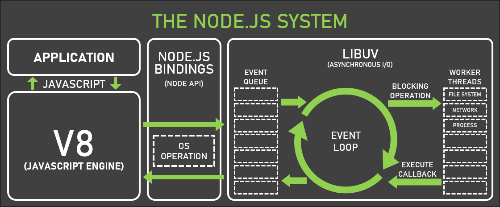

## V8

1. C++ 기반의 엔진.

2. C++ 기반이므로, JS전용의 컴파일러가 없이 C++의 것을 그대로 사용한다.

3. 추상화의 관점으로 보면 독립적인 구문, 고수준의 프로그래밍 언어의 컴파일 제공, 애플리케이션 로직을 작성하는데 필요한 기능을 갖추고 있어 언어로서 인정받을 수 있었다.

## nodeJS

- nodeJS는 수많은 관련 라이브러리들이 실행될 수 있는 "환경"을 제공한다. 그래서 런타임환경이라는 별칭으로 주로 불린다.

- 다른 언어에선 기본 제공되지만, JS에선 제공되지 않는 패키징과 배포 기능을 제공해준다.

  - 서버환경에서 실행이 가능해진다. 왜냐하면 기존에는 브라우저를 반드시 거쳐야했지만, 운영체제와 상호작용이 가능해졌기 때문이다.

  - 기존의 보안 상의 이유로 운영체제나 입출력에 제한이 있었던 js에 그 기능들을 추가해주고 컴파일된 파일을 저장하거나 메모리에 올릴 수 있게 만들어준다.

  - 브라우저는 실행 단계의 코드들을 실행시켜 줄뿐이였고, 패키징은 개발자의 몫이였지만 npm의 라이브러리가 패킹징을 제공할 수 있게 만들어줬다. 라이브러리가 패키징이 가능해진 이유는 nodeJS가 운영체제 상호작용과 입출력이 가능하기 때문이다.

- V8에 제공하는 비동기 함수와 스레드풀 기능들은 실행 관점에선 함수들을 호출하는 형태로 nodeJS의 함수들을 가져와 쓰도록 제공하고 있다.

- 그래서 추상화된 구조도가 제각기 다를 수 있지만, 다른 것들은 많아도 틀린 것은 거의 없다는 점을 인식해야 한다.

## 자바스크립트 비동기와 이벤트 루프

nodejs가 싱글스레드인 이유, js의 기반이 싱글스레드이고 그 설계를 바꾸기보단 js의 싱글스레드를 활용하면서 브라우저의 멀티스레드를 활용하는 방식으로 개선했기 때문이다.

## 브라우저 엔진 내부 구성

- **Call Stack**: 자바스크립트 엔진이 코드 실행을 위해 사용하는 메모리 구조

- **Heap**: 동적으로 생성된 자바스크립트 객체가 저장되는 공간

- **Event Table**: 비동기 이벤트 처리, 주로 DOM 이벤트가 발생했을 때 어떤 callback 함수가 호출되어야 하는지를 알고있는 자료구조.

- **콜백 큐**: 콜백 함수들이 대기하는 큐.

- **마이크로태스크 큐**: Promise 객체와 async/await 함수들이 대기. 태스크 큐보다 우선 처리.

- **태스크 큐**: 타이머 기반 비동기 함수나 I/O 작업에서 대기하는 콜백 함수들이 들어있는 큐.

- **애니메이션 프레임 큐**: 웹 페이지에서 애니메이션 프레임을 저장한다.

- **_Web APIs(브라우저가 제공하는 API)_**: 브라우저에서 제공하는 API 모음으로, 비동기적으로 실행되는 작업들을 전담하여 처리한다.

- **_Callback Queue_**: 비동기적 작업이 완료되면 실행되는 함수들이 대기하는 공간

- **Event Loop**: 비동기 함수들을 적절한 시점에 실행시키는 관리자

V8 엔진과 렌더링 엔진을 따로 설명하진 않지만, 사실 포함되어 있다.

nodeJS의 구조도는 주로 비동기 작업 처리에 중점을 둔 반면, 브라우저 엔진 구조도는 통합된 시스템의 흐름에 중점을 둔다.

## Web APIs의 종류

각 API마다 스레드들이 할당되어 있고, 이들이 모여 멀티스레드로 구성된다.(스레드풀을 운용한다)

- DOM Events: 웹 페이지 내에서 발생하는 다양한 상호작용을 처리하는 시스템입니다.

  - DOM Events의 흐름:

    1. **이벤트 발생**: Web APIs가 이벤트를 감지.
    2. **이벤트 처리**: 이벤트와 관련된 정보들을 담은 이벤트 객체를 만들어, 이벤트 핸들러로 전달.
    3. **이벤트 핸들러 실행**: 이벤트 리스너가 처리 실행.

- XMLHttpRequest: 서버와 비동기적으로 데이터를 교환할 수 있는 객체. AJAX 기술의 핵심.

  - 동작 흐름

    1. **요청 전송 후**: Web APIs에서 백그라운드 스레드(메인 스레드의 주요 작업을 방해하지 않고, 백그라운드(사용자가 직접적으로 상호작용하지 않는 상태)에서 처리하는 별도의 스레드)로 처리됨. 작업 종료 후, 콜백 함수가 콜백 큐로.

    2. **이벤트 루프와 콜백 큐**: 이벤트 루프가 콜백 큐 확인, 콜백 함수를 콜 스택에 넣어 실행. 서버로부터 응답을 받고, onreadyStatechange 콜백 함수 실행.

    3. **응답 처리**: xhr.onreadystatechange에서 설정된 콜백 함수 실행, xhr.response나 xhr.responseXML을 통해 실행.

- **fetchAPI**: JS에서 비동기적으로 HTTP 요청을 보내고 응답 처리하는 API, Promise 기반. 동작방식은 XMLHttpRequest와 큰 차이없음.(마이크로태스크 큐 사용 차이)

- **Timer API**: 일정한 시간 간격으로 함수를 실행하거나 지연시키는 메소드들을 제공.

  - 동작 흐름

    1. 함수 호출.
    2. Web APIs로 전달.
    3. 타이머 시작.
    4. 시간 경과 후 콜백 큐에 추가.
    5. 이벤트 루프가 콜백 큐에서 콜 스택으로 옮김.(interval은 반복)

- **Console API**: 콘솔에 메시지를 출력하거나 디버깅을 돕기 위한 여러 기능을 제공.(브라우저 상에서 바로 실행, 동기적.)

- **Canvas API**: 주로 \<canvas>와 같이 사용됨. 그래픽을 그리거나, 이미지, 애니메이션, 그래픽을 조작하는 방법 제공.(렌더링 엔진이 처리)

- **Geolocation API**: 웹 브라우저에서 사용자의 현재 위치 정보를 얻을 수 있는 메소드 제공.:

  1. **위치 정보 요청**: navigator.geolocation.getCurrentPosition() 또는 navigator.geolocation.watchPosition()을 통해 위치 요청을 브라우저에게 전달.

     - 요청 수단

       1. GPS: 모바일 기기에서 주로 사용됩니다.
       2. IP 주소: IP 기반 위치 추적.
       3. Wi-Fi: Wi-Fi 연결된 위치 정보를 사용.

  2. **위치 정보 조회**: 비동기적으로 조회. 신호의 강도나 연결 상태에 따라 걸리는 시간이 다름. Geolocation API는 콜백 함수를 사용하여 위치 정보가 준비되었을 때, 콜백 큐에 대기.

     1. 성공시: successCallback이 호출됩니다.
     2. 실패시: 위치 정보를 찾을 수 없거나 오류가 발생하면 errorCallback이 호출됩니다.

  3. **이벤트 루프 및 비동기 처리**: 위치 정보 요청은 비동기 작업으로 처리되며, 위치 정보가 준비되면 콜백 함수가 마이크로태스크 큐나 콜백 큐에 들어가게 됩니다.(프로미스와 콜백 둘 다 사용할 수 있음.)

- **애니메이션 프레임 큐**: 애니메이션을 구성하는 여러 프레임을 저장하고 관리하는 자료 구조입니다.(렌더링 엔진에서 처리)

## nodejs 내부 구성도.

- **_주의!_**: 일부 잘못된 구조도입니다. bindings는 결과값 출력으로 상호작용하므로 중재자 역할을 한다고 보기 어렵고, worker threads는 libuv에 포함되어 상호작용하지 않습니다.

- **V8**(JS 엔진, C++ 기반)

- **Bindings**(Node API): Node.js 시스템과 V8 엔진과 운영체제와 상호작용을 가능하게 하는 C++ 라이브러리.

- **OS OPERATION**: Node.js가 운영체제와 상호작용할 수 있는 기능들.

- **Libuv 라이브러리**: Node.js에서 비동기 I/O 작업을 처리하기 위한 C 라이브러리, 요청 처리는 싱글스레드, 작업을 지시할 때는 멀티스레딩과 스레드풀 활용, (라이브러리처럼 호출되어 V8 엔진 위에서 동작)(다소 특이한 작업방식, 비동기 작업도 싱글스레드가 처리하지만 지연되면 백그라운드 스레드에 넘겨준다. 가짜 스레드풀이라고도 불림.)(4개의 스레드들을 마킹(확보가 아님)해놓고, 해당 스레드들을 백그라운드 스레드로 활용.)

- **Event Queue**: 비동기 I/O 작업 결과를 저장하고 처리하기 위한 자료구조(태스크큐, 마이크로태스크큐, 콜백큐를 포괄하는 상위 추상화 개념)

- **Event Loop**: Event Queue에 저장된 I/O 작업 결과를 처리하고, 다음 작업을 수행하도록 하는 관리자

- **Worker Threads**: CPU 집약적인 작업을 처리하기 위해 Node.js 10 버전부터 추가된 멀티 스레드. worker threads는 메인 스레드와 독립적인 V8 엔진 인스턴스를 가진다.(명시적 호출 필요, nodeJS의 내장 모듈, 전통적인 스레드풀 활용, libuv와는 별개의 라이브러리)

- **Web APIs**: 브라우저에서 제공되는 기능들 중 서버에서 필요한 기능들. 구조도 상에선 나오지 않지만 구성요소.

- **node-gyp**: node에서 제공하는 애드온 컴파일 도구, 구조도에 명시는 없지만 존재한다.

실제 동작방식은 운영체제와 필요한 함수들을 libuv에서 호출하는 방식이지만, 관리에 필요한 메커니즘은 libuv가 지니고 있으며 그때문에 이벤트 루프를 libuv가 내재하고 있는걸로 묘사되고 있다.

### nodeJS의 동작

- nodeJS는 V8의 코드를 직접적으로 수정하지 않는다, 그러므로 독립성을 유지할 수 있다. 그러면서도 내부적으로도 외부적으로도 기능을 추가하고 뗄 수 없는 결합을 이루고 있다.

- NodeJS 전체의 관점에서의 흐름

  - (옵션) 만약 엔진 외부에서 이용하는 C++ 코드를 작성하고, 이를 이용하고 싶다면 node-gyp(애드온 컴파일 도구)로 애드온으로 모듈화하고 호출하여 사용할 수 있다.

  1. js 코드에서 fs 모듈의 함수들같은 운영체제와의 상호작용이나 입출력을 위한 함수를 호출(비동기 작업 요청)한다.

  2. fs 모듈은 js로 작성되었지만, 그 내부는 실제론 C++ 애드온(libuv를 포함한 nodeJS의 비동기 처리 시스템)으로 입출력 혹은 운영체제와의 상호작용 등의 작업을 실시한다.

  3. libuv가 운영체제와의 상호작용이나 입출력을 처리한다. 그리고 작업의 콜백함수(C++ 형태의 함수 포인터)를 콜백 큐에 추가한다.

  4. 추가 과정에서 bindings가 C++형태의 함수 포인터를 js에서 쓸 수 있는 형태인 콜백함수로 전달해준다.

  5. 콜스택이 비었다면 콜백 큐에서 해당 작업을 이벤트 루프로 V8 엔진이 bindings에게 전달받은 콜백을 실행하여 비동기 작업의 결과나 오류를 반환한다.

  - 애드온: 두 언어 사이에서 상호작용할 수 있도록 작성된 문법을 지닌 라이브러리. nodeJS의 경우, 주로 C++과 js의 상호작용을 위한 문법으로 작성된 라이브러리를 의미한다.

  - 콜백 함수라는 표현을 사용했지만, js코드로서 전체적인 관점에서 콜백이고 C++의 관점에선 일반적인 함수 포인터. 다만 bindings를 거치며 C++의 함수 포인터를 js의 콜백처럼 쓸 수 있게 해준다.

  - 브라우저 환경도 사실 비슷하게 동작하지만, 브라우저에선 api 형태로 추상화가 잘 이루어져 있기에 그 내부의 상호작용을 알 필요가 없지만, nodeJS의 경우에는 nodeJS 내의 각 요소들 간의 상호작용이 언어의 연결을 처리해주기 때문에 알아야 한다.

  - C++ 코드를 node-gyp로 애드온으로 컴파일시켜주면 V8 엔진을 외부에서 조작이 가능하다. 하지만 편의상 libuv가 애용될 뿐이고 애드온은 비동기 작업이라고 해도 **반드시 libuv를 포함할 필요는 없으며**, 그 덕분에 nodeJS는 높은 수준의 확장성과 유연성을 자랑한다.

  - C++가 C의 상위 호환성 언어이기 때문에 C에서 작성된 코드는 C++에서도 실행가능하며, libuv에서 출력된 결과값도 C의 형태이지만 C++기반인 Node.js에서도 실행이 가능하다.

## 이벤트 루프와 콜 스택, 이벤트 큐

- 구성

  1. 이벤트 루프(반복적으로 실행, 실행할 작업 확인 처리)

  2. 콜백 큐(비동기 작업이 완료되면 해당 작업에 등록된 콜백 함수가 콜백 큐에 추가.)

  3. 태스크 큐(타이머 작업 등을 포함, 지연된 후 실행)

  4. 마이크로태스크 큐(프로미스, async/await 작업 등, 지연된 후 실행.)

- 이벤트 루프의 동작 원리

  1. 콜 스택(현재 실행중인 동기 작업 확인)

  2. 콜백 큐 확인(콜 스택이 비어있으면 콜백 함수들 실행)

  3. 마이크로태스크 큐 확인(마이크로태스크 확인 및 실행)

  4. 태스크 큐 확인(태스크 큐에서 대기중인 작업 처리)

  5. 이 과정을 반복.

  - 이 과정들에서 비동기 작업의 큐들을 확인할 경우, 콜 스택에 적재한 후 큐가 비어있으면 이벤트 루프가 실행된다.

  - 콜 스택에의 적재와 이벤트 루프의 동작은 동시에 일어나지 않는다.(싱글스레드 특징)

  - 태스크 큐 작업들은 일반적으로 web APIs나 libuv가 처리하며, 해당 요소들은 이벤트 루프의 콜 스택의 작업처리와 별개로 동작하고, 비동기 작업이 완료되며 콜백을 해당 부류의 큐에 적재한다.

  - 이러한 특성들로 인해 web APIs 등에서 비동기 작업의 무한루프를 만들어 콜 스택으로의 태스크 큐의 콜백의 적재를 멈추지 않게 만들면, 웹사이트는 동작을 멈추게 된다.

  - 렌더링 작업은 모든 js코드가 완료된 후에 일어나므로 이벤트 루프가 모든 작업을 완료한 후에 렌더링 작업이 발생한다.

- async/await 작업 처리

  1. await 등장 전까지는 동기 코드로 실행된다. 콜 스택으로 동작한다.

  2. await 키워드가 등장하면, 후속 코드들(함수 내부)은 전부 Promise 객체의 then() 콜백함수로서 동작한다. await 이후의 코드는 함수 외부의 코드들도 모두 마이크로태스크 큐에 적재된다.

  3. return값은 Promise의 마지막 함수의 resolve()에 위치하게 된다.

  - async/await 기법은 실상은 promise로 비동기 처리를 진행하는 방식이다.

  - async는 promise 객체를 항상 결과값으로 반환(await 키워드 전까지는 동기 코드, await 이후는 then(), return은 resolve 함수로 처리된다).

  - async/await의 내부는 promise와 비동기 콜백 구조.

  - async 함수가 호출된 줄까지 포함해 이후의 코드들은 전부 마이크로태스크 큐에 적재된다. await는 상관없이 async 함수가 리턴하는 프로미스 객체의 resolve 값을 받아야하므로.

## 이벤트 루프 내부의 동작과정

- 전역 컨텍스트 (Global Context)

  1. 자바스크립트의 기본적인 실행 환경.

  2. global object와 this를 정의.

  3. 브라우저는 winodw, node.js에서는 global 객체

  4. 전역 실행 컨텍스트가 설정되면, 모든 코드는 전역 컨텍스트에서 실행

- 실행 컨텍스트 (Execution Context)

  1. 코드 실행 중에 활성화되는 환경

  2. 3가지 주요 정보를 가짐.

     1. Variable Environment(변수 환경): 사용할 수 있는 변수들의 선언과 값에 대한 정보를 지님.(호이스팅 이후 값 저장)

     2. Lexical Environment(어휘적 환경): 블록 스코프 혹은 함수 스코프에서 변수와 함수의 선언 및 유효 범위(호출 가능한 범위)에 대한 정보를 지님.

     3. This: 현재 실행중인 코드의 this 바인딩을 정의합니다.

  3. 클로저와는 적재되는 방식이 다름.(클로저는 정의 시점, 실행 컨텍스트는 호출 시점)

  - 각 실행 컨텍스트는 **콜스택(Stack)**에 쌓이고, 현재 실행 중인 코드가 해당 실행 컨텍스트 안에서 실행됩니다.

  - 실행 컨텍스트 생성 과정: 실행 컨텍스트가 생성될 때, variable Environment와 Lexical Environment가 설정됩니다. 이 두 환경은 **스코프 체인(Scope Chain)**을 형성하여, 변수에 접근할 수 있는 범위를 정의합니다.

- Variable Environment (변수 환경)

  1. 변수를 저장하고 관리하는 공간.

  2. 함수 실행 컨텍스트나 전역 컨텍스트에서 변수들이 어디에 저장될지 결정함.

     1. 현재 실행 중인 코드가 사용할 수 있는 변수와 함수 선언을 추적, js에선 변수 선언을 hoisting(호이스팅)해서 변수들을 실행 컨텍스트 내로 올리고 실행.

     2. 스코프 체인 관리에 중요한 역할, 실행 컨텍스트가 변수에 접근할 때 사용하는 스코프 체인을 생성.

  3. 선언과 동시에 초기화. let과 const도 마찬가지고, 그 떄문에 더미값이 들어가야만 했고 그 더미값에 대한 접근을 원천차단하는 개념인 TDZ가 등장한다.

### js 실행의 흐름 및 컨텍스트

1. 전역 코드 실행:

- 전역 컨텍스트 생성, 최상위 스코프의 변수와 함수가 정의되고 전역 실행 컨텍스트에 포함된다.

- variable environment에서 변수의 값과 선언을 정의, lexical environment에서 함수 및 블록스코프를 관리, 변수 선언 및 유효범위 관리.

2. 함수 호출 시 실행 컨텍스트 생성:

- 함수 호출시, 새로운 실행 컨텍스트가 콜스택에 push됨.

- 함수 내에서 변수 선언시, variable environment에 할당값이 있다면 값 지정, 없으면 임의의 값(undefined 등)으로 지정 및 선언 정보 추가.(전역 실행 컨텍스트와 다름)

- 실행 컨텍스트에서 변수를 찾을 수 없다면 lexical environment 또는 전역 컨텍스트의 렉시컬 환경의 스코프 체인을 참조 및 추적하여 variable environment에서 값을 찾는다.

3. 함수 실행 후: 함수 실행 컨텍스트는 콜스택에서 제거됨.

### 스코프 체인과 변수 환경 (Variable Environment) 연결

- 스코프 체인(Scope Chain)을 사용하여 변수에 접근. 스코프 체인은 실행 컨텍스트의 변수 환경 체크, 없으면 outer lexical context에서 변수를 탐색, 이 방식으로 스코프 체인 형성.

- 현재 실행 컨텍스트 -> outer 실행 컨텍스트 -> 전역 컨텍스트 순으로 값을 찾는다.

### for같은 흐름제어 구문에서 컨텍스트

for과 같은 흐름제어 구문이 등장해도 실행 컨텍스트가 새로 생성되는게 아니라 렉시컬 컨텍스트에 블록 스코프가 추가된다. 그 과정에서 let과 const의 값들이 선언 및 추적 정보가 추가되며 값이 할당된다.
